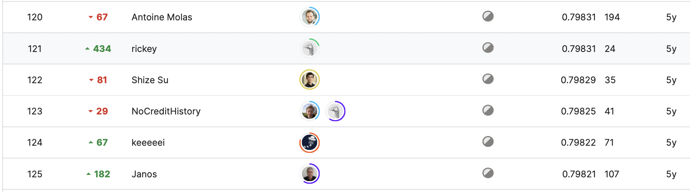

# Home Credit Default Risk

**Kaggle Competition:** [Home Credit Default Risk Overview](https://www.kaggle.com/competitions/home-credit-default-risk/overview)

**Model Developer:** [@julio.luna](https://github.com/julio.luna)

## Table of Contents

1. [Summary](#summary)
2. [Model Methodology and Outputs](#model-methodology-and-outputs)
3. [Feature Creation](#feature-creation)
4. [Feature Selection](#feature-selection)
5. [Hyperparameter Optimization](#hyperparameter-optimization)
6. [Model Evaluation](#model-evaluation)
7. [Model Explainability](#model-explainability)
8. [Model Ensemble in Detail](#model-ensemble-in-detail)
9. [Performance in the Competition](#performance-in-the-competition)
10. [Final Thoughts](#final-thoughts)
11. [Replicability](#replicability)
12. [Future Work](#future-work)

## Summary

### Introduction

This work serves as a reference for applying real-world machine learning models to solve business problems. The project encompasses various stages, from feature engineering to model deployment. The final model, which achieved the highest private score, consists of stacked models, each utilizing a boosting algorithm with different feature combinations and its own set of hyperparameters.

While it's well-known that ensembling several models can enhance performance in competitions, it's crucial to consider practical deployment challenges. Issues like model deployment, monitoring, and performance degradation over time are significant concerns that need to be addressed. This is why I personally believe that the best model in this work was developed using the "All relevant" approach, which has the lowest number of features (434) among all other models tested and even outperforms a model trained on the full feature set (1,147), resulting in a feature reduction of almost 3x.

The proposed model achieved a good performance on the private evaluation positioning the model approximately the **122nd** position (Silver medal).

##### Evaluation

Submissions are evaluated based on the [area under the ROC curve](http://en.wikipedia.org/wiki/Receiver_operating_characteristic) between the predicted probability and the observed target.

### Model Methodology and Outputs

The model approach is based on a binary classification algorithm (LightGBM) using features created from every data source provided. The final model consists of a Stacking ensemble of 5 different models whose predictions are aggregated using a Multilayer Perceptron.

The following table shows the different models along with the number of features used in each of them and their performances. For detailed information, please refer to the feature selection sections.

| Model            | Number of Features | OOF ROC AUC | Validation ROC AUC |
|------------------|--------------------|-------------|------------|
| boruta           | 426                | 0.795680    | 0.800874   |
| ensemble          | 820                | 0.792880    | 0.799627   |
| fw                | 329                | 0.792839    | 0.799425   |
| all features      | 1147               | 0.791760    | 0.799144   |
| optuna            | 555                | 0.788259    | 0.795938   |

The model outputs a probability of default that can be transformed into risk bands for the risk team to incorporate into the approval/rejection policy.

### Feature Creation

By preprocessing and aggregating all the datasets provided in the competition, a total of 1,147 features were created. These features consist of business knowledge aggregations and submodels on unaggregated data that were later aggregated at the customer level.

The number of features by data source is as follows:

1. **Main application:** 656
2. **Credit card:** 144
3. **Credit bureau:** 109
4. **Previous application:** 107
5. **Installments:** 74
6. **Point of sale:** 57

The feature creation process was the most time-consuming but undoubtedly the most important step. For comprehensive details, please refer to the [notebook](https://github.com/IamMultivac/house-default-credit/blob/master/research/create-input-dataset.ipynb).

### Feature Selection

The feature selection process involved exploring three different and independent approaches, along with an ensemble technique that combined features selected in at least one feature selection process.

The following processes were tested:

1. Minimum Redundancy Maximum Relevance using [SULOV](https://github.com/AutoViML/featurewiz)
2. Sequential Model-Based Optimization (SMBO) with the Tree Parzen Estimator (TPE)
3. All relevant selection using Boruta
4. Ensemble model using features selected in at least one process

Comprehensive details can be found in the [notebook](https://github.com/IamMultivac/house-default-credit/blob/master/research/feature-selection.ipynb).

### Hyperparameter Optimization

Utilizing [Optuna](https://optuna.org) for hyperparameter optimization allowed us to explore a larger space and find better hyperparameters that improved model generalization and helped regularize the model, reducing its reliance on a few features for predictions. The complete analysis is available [here](https://github.com/IamMultivac/house-default-credit/blob/master/research/hyperopt.ipynb).

### Model Evaluation

All models were evaluated on out-of-fold and validation sets to gauge their performance on the private dataset. Three different types of ensembles were tested on all submodel predictions:

1. Arithmetic mean
2. Linear model
3. MLP model

The following table displays the results:

| Model                 | OOF ROC AUC | Validation ROC AUC |
|-----------------------|-------------|---------------------|
| prediction_mlp        | 0.796771    | 0.805543            |
| prediction_lr         | 0.795479    | 0.801554            |
| prediction_average    | 0.795401    | 0.801386            |
| prediction_boruta     | 0.795680    | 0.800874            |
| prediction_ensemble   | 0.792880    | 0.799627            |
| prediction_MrMr       | 0.792839    | 0.799425            |
| prediction_all_features | 0.791760  | 0.799144            |
| prediction_Optuna     | 0.788259    | 0.795938            |

The table illustrates model performance once all hyperparameters have been optimized for each of them. The difference in performance between the Stacker model and Boruta is less than 0.004 in the out-of-fold evaluation. This suggests that in a real-world productive environment, the boruta model would likely be the best choice, especially considering its reduced feature set.

Complete analysis can be found [here](https://github.com/IamMultivac/house-default-credit/blob/master/research/model-ensemble.ipynb).

### Model Explainability

The explainability analysis was conducted using the Boruta model, which was the best performer among the non-stacker models. The SHAP values contribution revealed the top 10 most important features, from most to least impactful:

1. main_application__prediction
2. bureau__prediction_mean
3. previous_application__prediction_mean
4. main_application__ext_source_min
5. main_application__ext_source_max
6. main_application__category_encoded_code_gender_max_amt_annuity
7. previous_application__prediction_min
8. pos_cash__prediction_max
9. bureau__prediction_max
10. installments__prediction_max

These results indicate that the most impactful features are the inner models created from individual data sources. This approach effectively condensed information from each source, allowing the model to capture a high amount of information with a reduced set of features.

Regarding the importance by company type, there were no significant differences in the feature order among the risk bands, indicating that the most relevant features are important across all subpopulations.

By using the average absolute contribution of the SHAP values we can figure out the most relevant data sources, they can be listed from most important to least important:

1. Main application
2. Installments
3. Credit bureau
4. POS
5. Previous application
6. Credit card

This aligns with the intuition that the main application information contains external scores, likely including the FICO score.

Complete analysis is available [here](https://github.com/IamMultivac/house-default-credit/blob/master/research/shap-values-analysis.ipynb).

### Model Ensemble in Detail

Stacking is an ensemble learning technique that combines multiple classification models through a meta-classifier. The `StackingCVClassifier` extends the standard stacking algorithm, using cross-validation to prepare input data for the level-2 classifier.

In the standard stacking procedure, first-level classifiers are fit to the same training set used to prepare input for the second-level classifier, potentially leading to overfitting. The `StackingCVClassifier` uses cross-validation: the dataset is split into k folds, and in k successive rounds, k-1 folds are used to fit the first-level classifier. Each round, the first-level classifiers are then applied to the remaining 1 subset not used for model fitting. Predictions from these rounds are stacked and provided as input data to the second-level classifier. After training the `StackingCVClassifier`, first-level classifiers are fit to the entire dataset.

For this purpose, five different LightGBM models were trained on different subsets of data. Their predictions were then fed into a meta-learner that used cross-validation predictions from every model to train and predict the target variable. This approach, while showing improved performance, adds complexity to model deployment and monitoring, requiring attention to individual model behavior and hyperparameters of the stacker.

Complete analysis can be found [here](https://github.com/IamMultivac/house-default-credit/blob/master/research/model-ensemble.ipynb).

### Performance in the Competition

1. **Consistency in Model Performance:** The private and public scores for different models are very close, indicating consistent performance.
2. **Stacking Models:** "Stacking MLP," "Stacking LR," and "Stacking AVG" models perform similarly with scores around 0.7980 (private) and 0.8000 (public).
3. **Boruta + Optuna:** "Boruta + Optuna" model performs competitively with scores of 0.7980 (private) and 0.7992 (public).
4. **Model Selection:** Consider factors beyond just performance, including model complexity, interpretability, training time, and resource requirements.
5. **Ensemble and Model Tuning:** Stacking models and combining feature selection methods with hyperparameter optimization can be effective strategies.
6. **Further Investigation:** Explore feature importance, model interpretability, and experiment with different model architectures or hyperparameters.

In summary, while performance differences are subtle, choose a model considering practical aspects and continue experimentation for optimization.

The following tables show the performance on the public and private submissions:


As this competition has ended, we don't have direct access to the leaderboard position. However, based on manual inspection, the best model would likely be in the top 1%, approximately the 122nd position.





### Final Thoughts

The main takeaway from this project can be summarized as follows:

_"The best model doesn't always have the highest score."_

This means that one must consider the implications of model deployment, not just model performance, and that a performance difference of less than 0.001 may not justify an increase in model complexity.

### Replicability

To replicate the project, you can follow these steps:

```bash

!pip install -r requirements.txt
python3 main.py
```

### Future work

This project also served as an experiment framework. It was tested different approches for  model design and eventhought they did not finished  in the last model, it was worthy to test those techniques:
1. Monotone constrains.
2. Linear trees.

The details on those approaches may be found [here](https://github.com/IamMultivac/house-default-credit/blob/master/research/monotone-constraints.ipynb) and [here](https://github.com/IamMultivac/house-default-credit/blob/master/research/linear-trees.ipynb).

